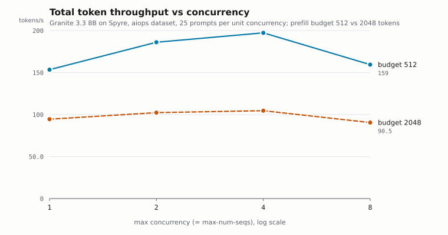
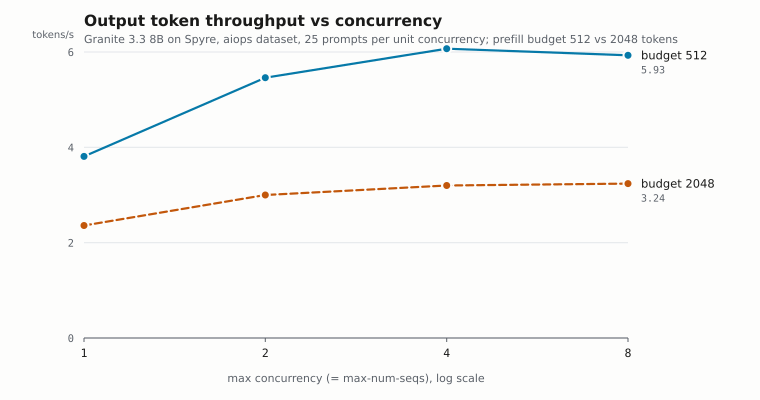
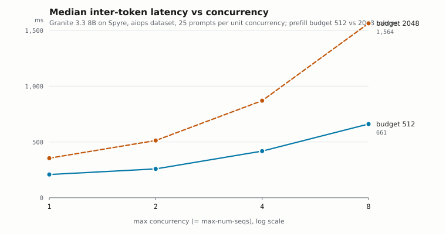
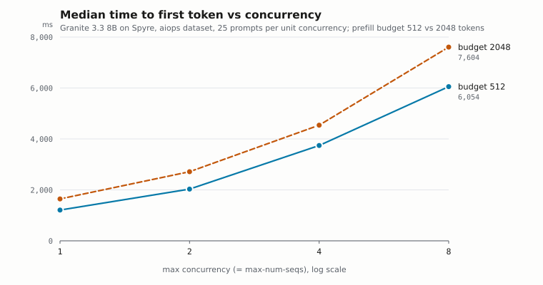

# Concurrency sweep — Granite 3.3 8B Instruct on Spyre

Online serving benchmark across `max-concurrency` 1 → 8, at two prefill budgets.

- Date: 2026-09-06
- Host: tpa-spyre-dev-4 (4 AIU devices, TP=1, single device)
- Model: `ibm-granite/granite-3.3-8b-instruct`, float16
- `torch-spyre` `da15ede83613870e2fc499f363aa0f98359994a9`, `USE_SPYRE_PROFILER=0`
- Branch: PR #789 (`f5c9fac`) + PR #784 (`75fd29f`) merged onto `main` (`c81a50c`)

## Results

Each point restarts the server with `--max-num-seqs` matched to `--max-concurrency`,
and scales prompts at 25 per unit of concurrency. `--num-gpu-blocks-override 2049`
is pinned on every point so KV cache size (262,272 tokens) does not co-vary.
All 700 requests across all 8 points succeeded; 0 failures.

### Prefill budget 512 (platform default)

| conc | prompts | med ITL | mean ITL | P99 ITL | med TTFT | P99 TTFT | med TPOT | out tok/s | total tok/s | prefix |
|---|---|---|---|---|---|---|---|---|---|---|
| 1 | 25 | 208.4 | 220.6 | 345.5 | 1,208 | 12,833 | 208.4 | 3.81 | 153.4 | 31.6% |
| 2 | 50 | 258.4 | 310.7 | 1,287 | 2,029 | 15,896 | 290.5 | 5.46 | 186.1 | 43.7% |
| **4** | 100 | 418.2 | 569.7 | 2,351 | 3,744 | 13,369 | 526.8 | **6.07** | **197.3** | 52.7% |
| 8 | 200 | 660.6 | 1,187.6 | 4,691 | 6,054 | 41,917 | 1,134.6 | 5.93 | 159.4 | 60.4% |

### Prefill budget 2048

| conc | prompts | med ITL | mean ITL | P99 ITL | med TTFT | P99 TTFT | med TPOT | out tok/s | total tok/s | prefix |
|---|---|---|---|---|---|---|---|---|---|---|
| 1 | 25 | 354.6 | 367.1 | 490.8 | 1,646 | 16,679 | 354.3 | 2.36 | 94.5 | 31.6% |
| 2 | 50 | 513.0 | 582.8 | 2,361 | 2,714 | 26,995 | 557.8 | 3.00 | 102.3 | 43.7% |
| 4 | 100 | 870.2 | 1,105.6 | 7,831 | 4,540 | 44,164 | 1,042.5 | 3.20 | 104.6 | 52.7% |
| 8 | 200 | 1,563.5 | 2,197.1 | 16,555 | 7,604 | 65,831 | 2,251.1 | 3.24 | 90.5 | 60.4% |

All latencies in ms.

## Figures









## Findings

### 1. Throughput peaks at concurrency 4 and regresses at 8

At the default 512 budget, total token throughput runs 153 → 186 → **197** → 159
tok/s. Concurrency 8 is barely better than concurrency 1 while costing 3.2x the
median ITL and 5x the median TTFT, and its P99 TTFT blows out to 42 s. The useful
operating range on this workload is **concurrency 2-4**.

The regression is understated by these numbers, because prefix-cache hit rate rises
with prompt count (31.6% → 60.4%, an artifact of scaling prompts with concurrency),
so the confound favours the high-concurrency points and they still lose.

### 2. This workload is prefill-dominated, and the prefill budget is the constraint

Input is 39x output (167,398 vs 5,279 tokens at concurrency 4), so ~97% of tokens
moved are prefill. With `max_num_batched_tokens` capped at 512, prefill bandwidth is
fixed per scheduler step, so extra concurrent sequences add queueing without adding
prefill capacity — hence the early saturation.

Prompt-length distribution (1,331 rows): min 399, p25 982, median 1,292, p75 1,928,
p90 2,765, p99 4,115, max 7,073; mean 1,537. Output tokens: median 52, mean 68.

At a 512 budget only **1.3%** of prompts prefill in a single step, averaging 3.58
chunks; at 2048 it would be 77.8% and 1.24 chunks.

### 3. Raising the prefill budget to 2048 makes everything worse

| conc | med ITL | med TTFT | total tok/s |
|---|---|---|---|
| 1 | 1.70x worse | 1.36x worse | 0.62x |
| 2 | 1.99x worse | 1.34x worse | 0.55x |
| 4 | 2.08x worse | 1.21x worse | 0.53x |
| 8 | 2.37x worse | 1.26x worse | 0.57x |

Roughly half the throughput and ~2x the inter-token latency, at every concurrency.
The 2048 series is nearly flat at 90-105 tok/s across a 8x concurrency range, versus
the 512 series which at least rises to a 197 peak — suggesting the 2048 config is
bottlenecked on something concurrency-independent.

Two mechanisms, acting on different metrics:

**Prefill (TTFT).** Chunked prefill exploits causality: chunk *i* attends only over
the KV accumulated so far, so it computes a block-triangular decomposition. One
large chunk computes the full square and masks half of it away. With our bucketing,
for a 1,536-token prompt:

```
512 budget:  512x512 + 512x1024 + 512x2048  = 1.83M query x KV products
2048 budget: 1536x2048                      = 3.15M          (ratio 1.72x)
```

**Decode (ITL).** Decode query length is 1 at both budgets, `num_blocks` is the
same, and `num_gpu_blocks` is pinned — so a pure decode step differs in essentially
one respect: `staging_rows = max_num_batched_tokens + 1` goes 513 → 2049. The
staging buffers are handed to the kernel at full size deliberately (a compiled
kernel reads its arguments from storage offset 0, torch-spyre#3770, so a slice past
row 0 would read the wrong storage), so the 4x larger declared size is visible to
the kernel even though decode needs one row.

This is a hypothesis, not a demonstration. The copies in `attn_layer` are
`q_in[:rows] = query` and `out_buf[:rows]`, i.e. `O(rows)` not `O(staging_rows)`, so
the naive "the copy is 4x bigger" explanation is wrong. And the effect is not
proportional: staging is 4x but ITL is 1.70-2.37x. Confirming it needs a profiled
decode step at each budget, comparing the attention kernel's device time per call.

If it holds, the design implication is that sizing staging buffers off
`max_num_batched_tokens` makes the prefill budget a tax on every decode step.

### 4. Contention relief is real but too small to matter

The one metric where the bigger budget improves relatively is TTFT, whose penalty
narrows from 1.36x at concurrency 1 to 1.21x at concurrency 4 — prefill contention
relief showing up exactly where predicted. It starts from a 1.36x deficit and never
recovers, and the growing ITL penalty swamps it.

## Commands

Both server and client sourced `~/spyre-libs/env.sh` (pinned libs ahead of the
system `/opt/ibm/spyre`) and set `PYTHONPATH=<worktree>`.

### Server, per point

```bash
export SPYRE_ATTN_RECORD=1
export SPYRE_NUM_CPUS=8

# budget 512 (platform default)
vllm serve --model ibm-granite/granite-3.3-8b-instruct \
    --max-model-len 8192 --max-num-seqs $CONC --num-gpu-blocks-override 2049

# budget 2048
vllm serve --model ibm-granite/granite-3.3-8b-instruct \
    --max-model-len 8192 --max-num-seqs $CONC --num-gpu-blocks-override 2049 \
    --compilation-config '{"compile_sizes":[1,...,$CONC,2048]}'
```

`--max-num-batched-tokens` on the CLI does **not** work: `platform.py:257` clamps it
to `min(passed, 512)` and line 285 then forces
`max_num_batched_tokens = max(compile_sizes)`. The escape hatch is an explicit
`compile_sizes` whose top entry is the budget you want, which line 253 honours.
The code comment calls 512 "Spyre max"; it starts and runs correctly at 2048, so it
is a conservative default rather than a hard limit.

### Client, per point

```bash
vllm bench serve --backend vllm \
    --model ibm-granite/granite-3.3-8b-instruct \
    --endpoint /v1/completions \
    --dataset-name custom \
    --dataset-path /models/online_benchmarking_data_reordered/aiops_results_2025.11.03_e2ee1b0_correct_order.jsonl \
    --num-prompts $((25 * CONC)) \
    --max-concurrency $CONC \
    --output-len -1
```

## Environment

| setting | 512 budget | 2048 budget |
|---|---|---|
| `max_num_batched_tokens` | 512 | 2048 |
| `block_size` | 128 | 128 |
| `num_gpu_blocks_override` | 2049 (262,272 tokens) | 2049 |
| `compile_sizes` | `[1..CONC, 512]` | `[1..CONC, 2048]` |
| attention query buckets | `{1, 512}` | `{1, 512, 1024, 1536, 2048}` |
| attention variants x layers | 14 x 40 = 560 graphs | 24 x 40 = 960 graphs |
| `staging_rows` | 513 | 2049 |
| attention recording | ~300 s | 1,478 s cold, ~705 s warm |
| prefix caching | enabled | enabled |
| compilation mode | `STOCK_TORCH_COMPILE` | `STOCK_TORCH_COMPILE` |

`vllm` 0.28.0 (`rev=v0.28.0`, `VLLM_TARGET_DEVICE=empty`), `torch` 2.13.0+cpu,
`transformers` 5.16.1. Pinned `ibm-*` RPMs: `ibm-deeptools 2324.4cfac4c_309`,
`ibm-flex 495.a86bb35_315`, `ibm-senlib-core 244.de8291a_214`,
`ibm-spyre-comms 124.3523cde_149`, `ibm-libaiupti 21.bd7054d_0`,
`ibm-aiu-toolbox-e2e 28.47d9b91_89`.

## Caveats

- Concurrency 16 and 32 were not run.
- Prefix-cache hit rate is not constant across points (31.6% → 60.4%): pinning
  `num_gpu_blocks_override` fixed cache *capacity*, but hit rate still rises with
  prompt count, since scaling prompts with concurrency means more repeated
  system-prompt prefixes to hit later in a longer run. This favours the
  high-concurrency points. It is identical between the two budgets at each
  concurrency, so the budget comparison is unaffected.
- Single run per configuration, no error bars. The concurrency-4 / 512 point
  reproduced an earlier standalone run to within 0.5% on median ITL (418.17 vs
  420.46 ms) and 1.8% on output throughput, which bounds run-to-run noise.
- Compile-time figures are cache-state dependent, not intrinsic: changing the budget
  changes `staging_rows`, which is a closure constant of every attention kernel, so
  the first 2048 point recompiled all 24 variants cold (1,478 s) and later points hit
  cache (~705 s). Compile cost is also concentrated in the largest `num_blocks`
  variants — the 18 smallest of 24 compiled in under a second combined.
