# How vLLM's Transformers backend rewires granite-3.3-8b

Notes on **upstream vLLM** behaviour under `--model-impl transformers`. Nothing
Spyre-specific; this branch is just a place to host the diagram.

vLLM runs Hugging Face's own `modeling_granite.py` forward code and surgically
swaps the modules underneath it. The key idea is **containment**: every vLLM
block sits *inside* an HF `forward`. vLLM never takes over a layer's control
flow — only the ops it calls.

## The rewired forward pass

```mermaid
flowchart TB
  classDef vllm fill:#dceef1,stroke:#0c6673,stroke-width:1.5px,color:#08343b
  classDef hf   fill:#f2ebdc,stroke:#8f6317,stroke-width:1px,color:#4a3308
  classDef bug  fill:#f6e3df,stroke:#a1382a,stroke-width:1.5px,color:#6b1f15

  subgraph M["GraniteModel.forward — HF, unchanged"]
    direction TB
    E["VocabParallelEmbedding<br/>49159 × 4096"]
    EM["× embedding_multiplier = 12.0<br/>outside the inputs_embeds branch"]
    RE["GraniteRotaryEmbedding → cos, sin<br/>never rewired"]

    subgraph L["GraniteDecoderLayer.forward — HF, unchanged — × 40"]
      direction TB
      N1["TPAwareRMSNorm<br/>input_layernorm"]

      subgraph A["GraniteAttention.forward — rewritten by QKVFuser"]
        direction TB
        QKV["QKVParallelLinear → q, k, v<br/>4096 → 4096 + 1024 + 1024"]
        RS1["view / transpose → 1, H, S, 128<br/>HF layout"]
        RO["apply_rotary_pos_emb q, k, cos, sin<br/>HF kernel, not vLLM fused rope"]

        subgraph H["ALL_ATTENTION_FUNCTIONS vllm — the one hook"]
          direction TB
          ATT["Attention<br/>paged KV cache · causal · 32 q / 8 kv heads<br/>impl.scale ← attention_multiplier = 0.0078125"]
        end

        RS2["reshape → S, 4096<br/>HF layout"]
        O["RowParallelLinear<br/>o_proj"]
      end

      R1["h = residual + attn_out × residual_multiplier 0.22"]
      N2["TPAwareRMSNorm<br/>post_attention_layernorm"]

      subgraph P["GraniteMLP.forward — rewritten by GLUFuser"]
        direction TB
        GU["MergedColumnParallelLinear<br/>gate_up_proj · 12800, 12800"]
        SM["SiluAndMul"]
        DP["RowParallelLinear<br/>down_proj · 12800 → 4096"]
      end

      R2["h = residual + mlp_out × residual_multiplier 0.22"]
    end

    NF["TPAwareRMSNorm<br/>final norm"]
  end

  LM["ParallelLMHead<br/>49159 × 4096 · tied to embed_tokens"]
  LP["LogitsProcessor scale = logit_scale<br/>logits_scaling = 16.0 is never read"]

  E --> EM --> RE --> N1 --> QKV --> RS1 --> RO --> ATT --> RS2 --> O --> R1
  R1 --> N2 --> GU --> SM --> DP --> R2
  R2 -.->|"next layer"| N1
  R2 --> NF --> LM --> LP

  class E,N1,QKV,ATT,O,N2,GU,SM,DP,NF,LM vllm
  class EM,RE,RS1,RO,RS2,R1,R2 hf
  class LP bug
```



**Legend** — blue: vLLM module or kernel. Tan: HF code running inline.
Red: vLLM, but wired to the wrong config field. Subgraph frames are HF
`forward` methods; `GraniteAttention.forward` and `GraniteMLP.forward` are the
only two that get re-parsed and recompiled, and only to redirect projection
calls.

<details>
<summary>Same diagram as plain text (nesting shown with box drawing)</summary>

```
 ┌─ GraniteModel.forward ─────────────────────────────────── HF, unchanged ──┐
 │   ▓▓ VocabParallelEmbedding ▓▓  49159 × 4096                              │
 │   ·  × embedding_multiplier = 12.0        (HF — outside inputs_embeds if)  │
 │   ·  GraniteRotaryEmbedding → cos, sin    (HF — never rewired)            │
 │  ┌─ GraniteDecoderLayer.forward ── HF, unchanged ── × 40 ───────────────┐  │
 │  │  ·  residual = hidden_states                                        │  │
 │  │  ▓▓ TPAwareRMSNorm ▓▓  input_layernorm                              │  │
 │  │ ┌╌ GraniteAttention.forward ╌╌╌ rewritten by QKVFuser ╌╌╌╌╌╌╌╌╌╌╌┐  │  │
 │  │ ╎  ▓▓ QKVParallelLinear ▓▓ → q,k,v    4096 → 4096+1024+1024      ╎  │  │
 │  │ ╎  ·  .view/.transpose → [1, H, S, 128]          (HF layout)     ╎  │  │
 │  │ ╎  ·  apply_rotary_pos_emb(q, k, cos, sin)       (HF kernel)     ╎  │  │
 │  │ ╎ ┌─ ALL_ATTENTION_FUNCTIONS["vllm"] ── the one hook ─────────┐  ╎  │  │
 │  │ ╎ │  ▓▓ Attention ▓▓  paged KV cache, causal, 32 q / 8 kv     │  ╎  │  │
 │  │ ╎ │  ·  impl.scale ← attention_multiplier = 0.0078125         │  ╎  │  │
 │  │ ╎ └───────────────────────────────────────────────────────────┘  ╎  │  │
 │  │ ╎  ·  .reshape → [S, 4096]                       (HF layout)     ╎  │  │
 │  │ ╎  ▓▓ RowParallelLinear ▓▓  o_proj                               ╎  │  │
 │  │ └╌╌╌╌╌╌╌╌╌╌╌╌╌╌╌╌╌╌╌╌╌╌╌╌╌╌╌╌╌╌╌╌╌╌╌╌╌╌╌╌╌╌╌╌╌╌╌╌╌╌╌╌╌╌╌╌╌╌╌╌╌╌┘  │  │
 │  │  ·  h = residual + attn_out × residual_multiplier (0.22)            │  │
 │  │  ▓▓ TPAwareRMSNorm ▓▓  post_attention_layernorm                     │  │
 │  │ ┌╌ GraniteMLP.forward ╌╌╌╌╌╌╌╌ rewritten by GLUFuser ╌╌╌╌╌╌╌╌╌╌╌┐  │  │
 │  │ ╎  ▓▓ MergedColumnParallelLinear ▓▓  gate_up_proj [12800,12800]  ╎  │  │
 │  │ ╎  ▓▓ SiluAndMul ▓▓                                             ╎  │  │
 │  │ ╎  ▓▓ RowParallelLinear ▓▓  down_proj  12800 → 4096              ╎  │  │
 │  │ └╌╌╌╌╌╌╌╌╌╌╌╌╌╌╌╌╌╌╌╌╌╌╌╌╌╌╌╌╌╌╌╌╌╌╌╌╌╌╌╌╌╌╌╌╌╌╌╌╌╌╌╌╌╌╌╌╌╌╌╌╌╌┘  │  │
 │  │  ·  h = residual + mlp_out × residual_multiplier (0.22)             │  │
 │  └─────────────────────────────────────────────────────────────────────┘  │
 │   ▓▓ TPAwareRMSNorm ▓▓  final norm                                        │
 └───────────────────────────────────────────────────────────────────────────┘
       then, in TransformersForCausalLM (CausalMixin):
       ▓▓ ParallelLMHead ▓▓  49159 × 4096, tied to embed_tokens
       ▒▒ LogitsProcessor(scale=logit_scale) ▒▒  ← logits_scaling=16.0 never read
```

</details>

## Construction order

Order in `TransformersBase.__init__` (`vllm/model_executor/models/transformers/base.py`):

| # | step | what it does |
|---|------|--------------|
| 1 | `_patch_config` | Sets `_attn_implementation = "vllm"`, the single hook HF exposes |
| 2 | `AutoModel.from_config` | Builds `GraniteModel` on the `meta` device — no weights, no buffers |
| 3 | `pipeline_parallel` | Replaces off-rank decoder layers with `PPMissingLayer()` |
| 4 | `recursive_replace` | `torch.fx` traces each module *class* once, matches a fuser, rewrites forwards, swaps linears and norms |
| 5 | `create_attention_instances` | 40 `Attention` objects for the KV cache, dispatched to by name |
| 6 | `replace_embedding_class` | Swaps the input embedding — a separate step *after* `recursive_replace` (`base.py:172-177`) |
| 7 | `init_parameters` | Allocates real tensors for anything still on `meta` |
| 8 | `load_weights` | At load time, via `AutoWeightsLoader` + the `WeightsMapper` the fusers populated |

## Every module that changes hands

40 layers, TP 1.

| HF module | becomes | count | mechanism |
|---|---|---|---|
| `nn.Embedding(49159, 4096)` | `VocabParallelEmbedding` | 1 | `replace_embedding_class`, after `recursive_replace` |
| `q_proj` + `k_proj` + `v_proj` | `qkv_proj` `QKVParallelLinear` | 120 → 40 | `QKVFuser` — three linears sharing one `fx` placeholder; q is the odd width out |
| `o_proj` | `RowParallelLinear` | 40 | `QKVFuser.update_attrs` (it owns the whole attention block) |
| `gate_proj` + `up_proj` | `gate_up_proj` `MergedColumnParallelLinear` | 80 → 40 | `GLUFuser` — matches `act(gate(x)) * up(x)` |
| `act_fn` (`SiLU`) | `SiluAndMul` | 40 | `GLUFuser`, via `_ACTIVATION_AND_MUL_REGISTRY` |
| `down_proj` | `RowParallelLinear` | 40 | `GLUFuser.update_attrs` |
| `GraniteRMSNorm` | `TPAwareRMSNorm` | 81 | `RMSNormFuser` — dataflow match, then an eps-marker retrace to find the `eps` attribute |
| attention math in `GraniteAttention` | `Attention` | 40 | `_attn_implementation = "vllm"` → `vllm_attention_forward` |
| *(added, not replaced)* | `ParallelLMHead` + `LogitsProcessor` | 1 | `CausalMixin`; `AutoModel` never builds an LM head |

## What stays Hugging Face

- **`GraniteRotaryEmbedding`.** There is no registry to inject into, and the
  signatures disagree: HF wants `(x, position_ids) → (cos, sin)` applied *after*
  the projections, vLLM's `RotaryEmbedding.forward` wants
  `(positions, q, k) → (q, k)`. Consequence: vLLM's fused rope kernels never
  fire on this path. HF also owns the whole `rope_scaling` config surface —
  Granite 3.3 sets it to `null`, so `torch.compile` stays enabled
  (`can_enable_torch_compile` disables it for `rope_type == "dynamic"`) and the
  HF rope is at least compiled in.
- **All forward control flow.** `GraniteModel.forward` and
  `GraniteDecoderLayer.forward` are untouched.
- **The tensor-layout round trip.** `qkv_proj` returns `[S, 6144]`; HF splits and
  reshapes to `[1, H, S, 128]`, then back to `[S, 4096]` for `o_proj`. Both
  reshapes are pure HF code either side of the attention hook.
- **Anything a fuser can't see.** `LayerNorm`, unmatched RMSNorms, standalone
  activations, and any module whose traced graph misses a known pattern. Granite
  fuses cleanly; a model with an unusual norm gets a warning and keeps HF's
  implementation.

## Granite's four muP multipliers

Three survive because they live in HF forward code the backend doesn't touch.
The fourth lives in the `ForCausalLM` wrapper that `AutoModel` never builds.

| config field | value | where it runs | status |
|---|---|---|---|
| `embedding_multiplier` | 12.0 | `GraniteModel.forward`, outside the `inputs_embeds` branch | applied |
| `attention_multiplier` | 0.0078125 | passed as `scaling=` to the hook, which overwrites `impl.scale` | applied |
| `residual_multiplier` | 0.22 | `GraniteDecoderLayer.forward`, twice per layer | applied |
| `logits_scaling` | 16.0 | `GraniteForCausalLM` divides logits by it — but `CausalMixin` reads `logit_scale`, and nothing aliases the two names | **dropped** |

`attention_multiplier` is worth noting: 0.0078125 is 1/128, whereas
`create_attention_instances` defaults `scale` to `head_size**-0.5` ≈ 0.0884. The
override in `vllm_attention_forward` is load-bearing, not cosmetic.

The `logits_scaling` gap means logits come out 16× too large, which flattens
temperature into near-greedy sampling. Greedy decoding hides it entirely — which
is why it can sit unnoticed. vLLM's native `granite.py` handles it at
`granite.py:430`:

```python
if hasattr(config, "logits_scaling"):
    logit_scale /= config.logits_scaling
```

This is unfixed and unreported upstream as of 2026-08-21. The nearest related
open item is vllm-project/vllm#52156 (*Apply attention sinks in the Transformers
backend*, draft) — the same class of gap: the backend has no systematic way to
recover behaviour that lives in the `ForCausalLM` wrapper.

## Three different senses of "transformers" in vLLM

Worth separating, because the timelines differ by months:

1. **vLLM depends on the `transformers` library** — configs, tokenizers,
   processors. Always has.
2. **vLLM has native re-implementations** of many HF architectures under
   `vllm/model_executor/models/`. `BertModel` landed in #9056 (2024-10-17).
3. **The Transformers modeling *backend*** — running HF's actual `modeling_*.py`
   forward code inside vLLM — arrived in #11330 (2025-02-03); encoder support in
   that backend came much later, in #25174 (2025-09-19).

So native encoder support predates the backend itself by about four months. Both
paths coexist today and the native one wins by default; `--model-impl
transformers` is the switch. To check which you got:

```python
llm.apply_model(lambda m: print(type(m)))
```

## Provenance

vLLM-side details read from a `vllm-project/vllm` working tree at commit
`f8e0602713`. Granite module structure and HF forward ordering read from
`transformers` `main` and `ibm-granite/granite-3.3-8b-instruct/config.json`;
`transformers` was not importable in that checkout, so nothing here was
confirmed by running the model.

There is also a standalone `granite-transformers-backend-rewiring.html` in this
directory — the same content as a self-contained styled page. GitHub shows
`.html` as source, so view it locally or through a raw-HTML previewer.
